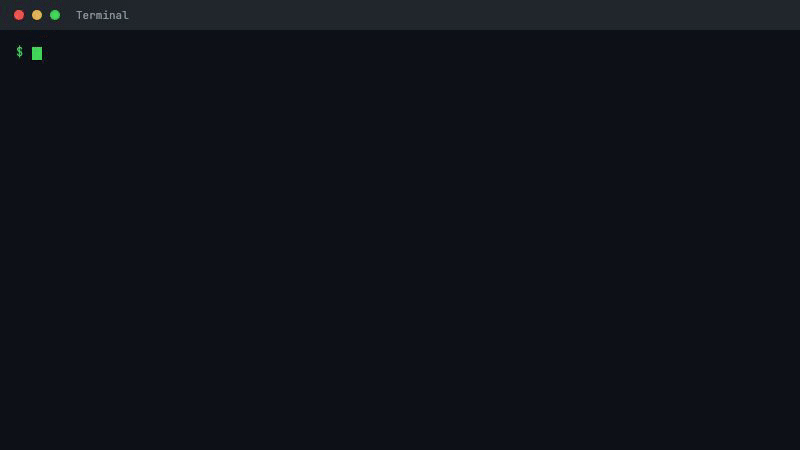
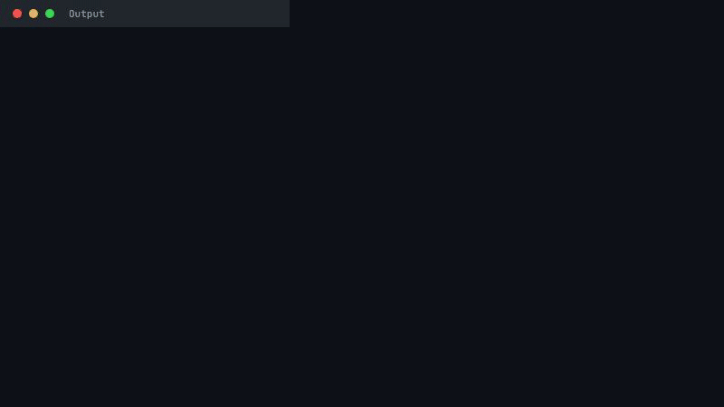
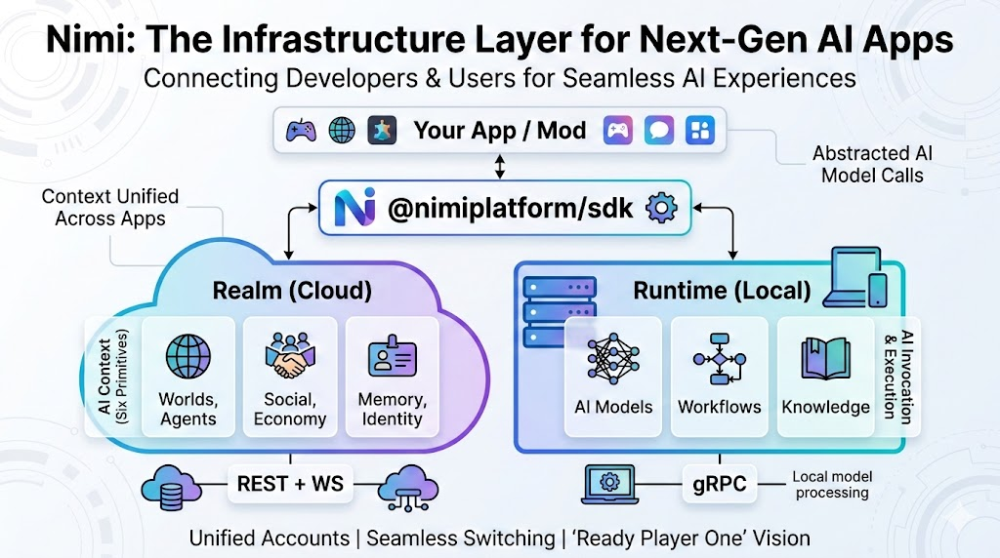

<div align="center">

  # 🪸 Nimi: AI runtime for apps.

  [](https://github.com/nimiplatform/nimi)
  [](https://github.com/nimiplatform/nimi)
  [](https://github.com/nimiplatform/nimi/actions/workflows/ci.yml)
  [](LICENSE)
  [](runtime/go.mod)
  [](package.json)
</div>

[Website](https://nimi.xyz) | [Getting Started](docs/user/index.md) | [Nimi Coding](docs/nimi-coding.md) | [SDK Reference](docs/reference/sdk.md) | [Examples](examples/README.md) | [Spec](spec/INDEX.md) | [Discord](https://discord.gg/BQwHJvPn)

Build AI apps against one runtime, one SDK, and one operational surface for local and cloud AI.

<p align="center">
  
</p>

> **Rapid Development Phase** Nimi is still in an extremely fast-moving stage.
> Expect breaking changes, tightened contracts, and occasional docs drift between releases. For normative behavior, use [`spec/`](spec/INDEX.md) as the source of truth and treat [`spec/future/`](spec/future/index.md) as backlog rather than release commitments.

## Download

| Platform | Status | Link |
|---|---|---|
| macOS (Apple Silicon) | Desktop release on GitHub | [GitHub Releases](https://github.com/nimiplatform/nimi/releases) |
| macOS (Intel) | Desktop release on GitHub | [GitHub Releases](https://github.com/nimiplatform/nimi/releases) |
| Windows | Desktop release on GitHub | [GitHub Releases](https://github.com/nimiplatform/nimi/releases) |
| Linux | Desktop release on GitHub; CLI + SDK also available | [GitHub Releases](https://github.com/nimiplatform/nimi/releases) |

The desktop app is the fastest way to get started. For CLI-only installs, prefer GitHub Releases or `npm install -g @nimiplatform/nimi` on supported macOS/Linux/Windows targets.
> In early access, macOS desktop assets may be published in ad-hoc signing mode before Apple Developer ID notarization is configured.

## Install

```bash
npm install -g @nimiplatform/nimi
```

Release assets are published on GitHub Releases together with `checksums.txt`, SBOMs, and sigstore bundles. Verify those artifacts before manual installation. The npm package installs the platform-specific CLI launcher for your current OS and architecture.

## 30-Second Start

```bash
nimi start
```

Then:

```bash
nimi doctor
nimi status
nimi run "What is Nimi?"
```

For cloud:

```bash
nimi run "What is Nimi?" --provider gemini
```

That command will prompt for a missing API key once, save it to the runtime machine config, and continue the same run.

For a reusable machine default:

```bash
nimi provider set gemini --api-key-env NIMI_RUNTIME_CLOUD_GEMINI_API_KEY --default
export NIMI_RUNTIME_CLOUD_GEMINI_API_KEY=YOUR_KEY
nimi run "What is Nimi?" --cloud
```

<p align="center">
  
</p>

Same runtime. Same CLI. Different execution plane.

## Use In Your App

```bash
npm install @nimiplatform/sdk
```

```ts
import { createPlatformClient } from '@nimiplatform/sdk';

const { runtime } = await createPlatformClient({
  appId: 'readme.quickstart',
});

const local = await runtime.generate({
  prompt: 'Explain Nimi in one sentence.',
});

const cloud = await runtime.generate({
  provider: 'gemini',
  prompt: 'Explain Nimi in one sentence.',
});

console.log('[local]', local.text);
console.log('[cloud]', cloud.text);
```

The runtime call shape stays the same. Add `provider` when you want the cloud default for a provider.

If the runtime is not running, `nimi run` points you back to `nimi start`.

High-level onboarding stays on `nimi run`, `createPlatformClient()`, and `runtime.generate()/stream()`. Fully-qualified explicit model ids stay on lower-level surfaces such as `nimi ai text-generate --model-id ...` and `runtime.ai.text.generate({ model: ... })`.

<p align="center">
  
</p>

## Vercel AI SDK

```ts
import { generateText } from 'ai';
import { createPlatformClient } from '@nimiplatform/sdk';
import { createNimiAiProvider } from '@nimiplatform/sdk/ai-provider';

const { runtime } = await createPlatformClient({
  appId: 'readme.vercel-ai',
});
const nimi = createNimiAiProvider({ runtime });

const { text } = await generateText({
  model: nimi.text('gemini/default'),
  prompt: 'Hello from Vercel AI SDK + Nimi',
});
```

## Why Nimi Feels Different

- One runtime for local and cloud AI, instead of stitching together local runners, cloud SDKs, and app-specific glue
- Runtime-backed streaming, health checks, model lifecycle, and operational commands
- A clean app-facing SDK that can stay stable while execution moves between local and cloud
- A path from app integration to desktop-hosted experiences and mods

This is not just a provider wrapper. The runtime is a real execution boundary.

## What Nimi Is

Nimi has three practical layers:

- Runtime: local Go daemon for routing, inference, streaming, health, model lifecycle, workflow, knowledge, and audit
- SDK: TypeScript SDK for integrating runtime and realm into apps
- Desktop: host shell and mod surface for desktop AI experiences

Realm is Nimi's optional cloud state layer for identity, memory, and cross-app continuity.
The runtime, SDK, and desktop contracts are the active core; future and ecosystem capabilities are still being graduated into those layers.

## Current Specification Status

Nimi's public status should be read from the current spec, not from dated roadmap promises.

| Layer | Current status in spec | What it means |
|---|---|---|
| Runtime | Kernel contracts cover the full proto surface; AI/auth is active and workflow/model/knowledge/app/audit contracts are already defined in kernel | Runtime behavior is contract-first, but implementation details may still harden quickly |
| SDK | `runtime`, `realm`, and `ai-provider` are Phase 1 active; `scope` and `mod` are defined and still evolving | Prefer `createPlatformClient()` for app entry and treat lower-level subpaths as advanced surfaces |
| Desktop | Kernel + domain contracts are active across shell, local AI, mod governance, and testing gates | Desktop UX and extension surfaces may keep shifting as runtime/sdk contracts tighten |
| Future | `spec/future/**` is structured backlog, not a shipping promise | Planned capabilities should not be read as committed dates or guaranteed release order |

## Examples

The onboarding ladder lives in [examples/README.md](examples/README.md).

Start here:

```bash
npx tsx examples/sdk/01-hello.ts
npx tsx examples/sdk/02-streaming.ts
npx tsx examples/sdk/03-local-vs-cloud.ts
npx tsx examples/sdk/04-vercel-ai-sdk.ts
```

The same runtime surface also covers multimodal flows such as image generation and TTS:

<p align="center">
  
</p>

## Architecture

<p align="center">
  
</p>

- Runtime: local execution and operational control
- Realm: cloud state and continuity
- SDK: application-facing integration layer
- Desktop: host experience and extension surface

## Core Components

| Component | Description | Stack |
|---|---|---|
| [runtime](runtime/README.md) | Local AI daemon and CLI | Go, gRPC |
| [sdk](sdk/README.md) | Unified SDK for runtime and realm | TypeScript, ESM |
| [desktop](apps/desktop/README.md) | Desktop host and mod ecosystem | Tauri, React |
| [web](apps/web/README.md) | Web client | React |
| [spec](spec/INDEX.md) | Normative contracts | Markdown, YAML |
| [docs](docs/index.md) | Developer portal | VitePress |

## Supported Providers

Representative routing planes:

| Plane | Examples |
|---|---|
| `local/*` | Canonical local engines (`llama`, `media`, `speech`) |
| `cloud/*` | OpenAI, Gemini, Anthropic, DeepSeek, GLM, MiniMax, DashScope, Volcengine |

For a deeper matrix, see [provider docs](docs/reference/provider-matrix.md).

## Contributing

If you are developing Nimi itself from source, then you do need the contributor toolchain:

- Go `1.24+`
- Node.js `24+`
- pnpm `10+`

See [CONTRIBUTING.md](CONTRIBUTING.md).

## License

Apache-2.0 / MIT. See [LICENSE](LICENSE).
