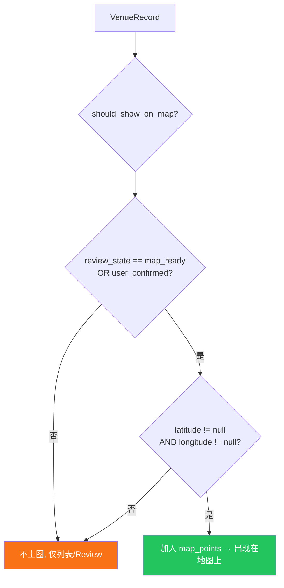
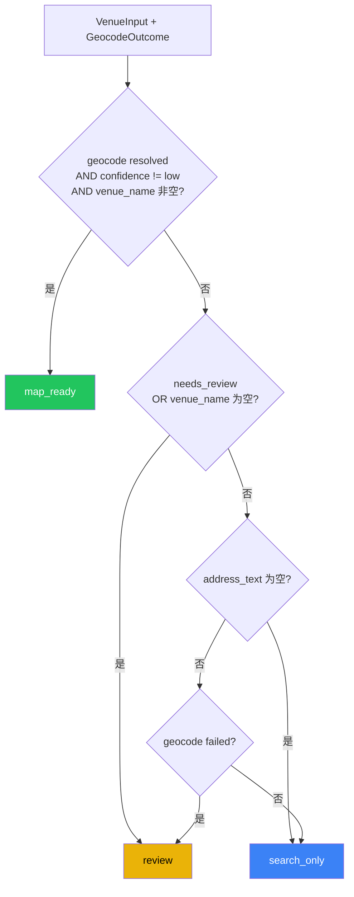
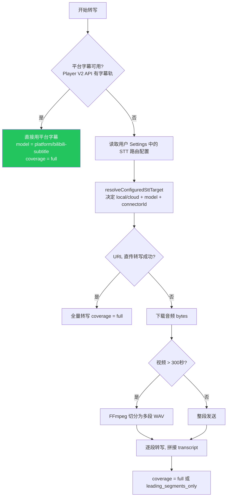
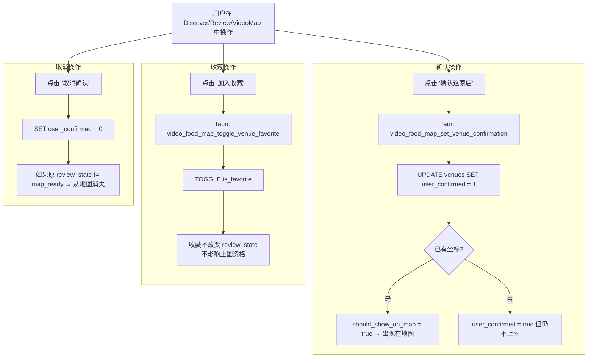
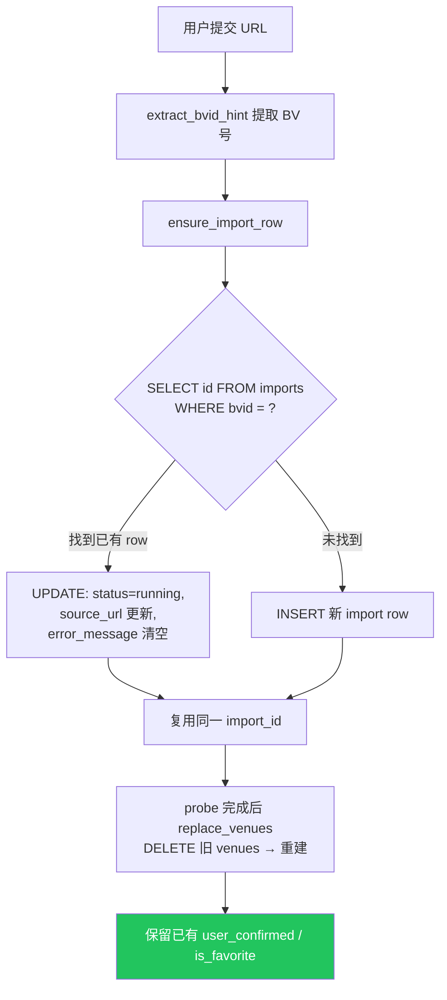
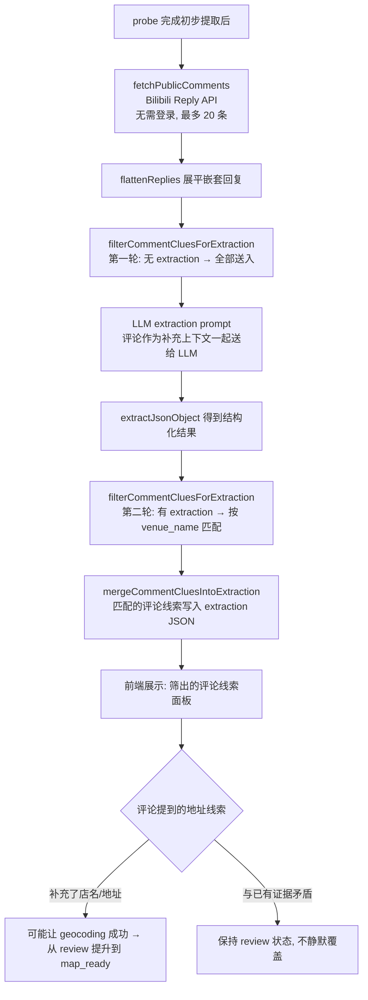
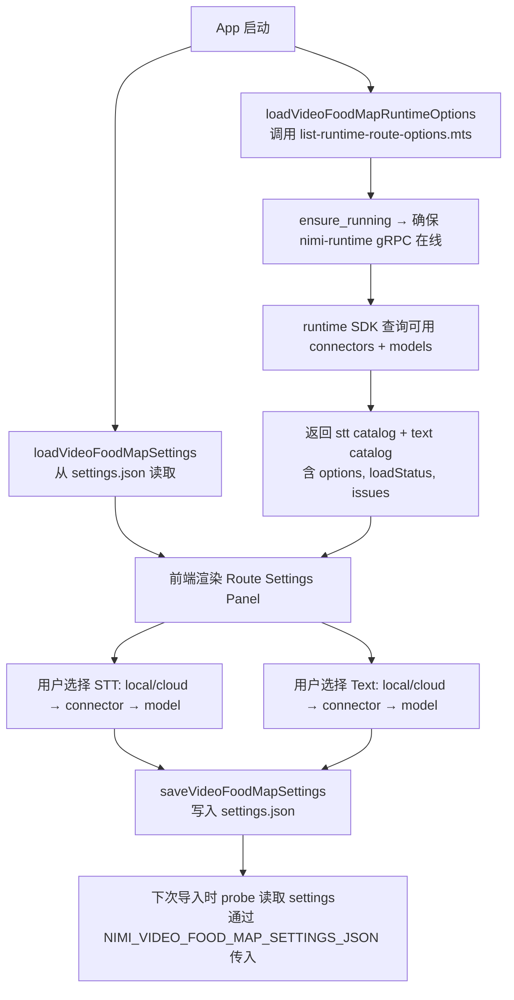
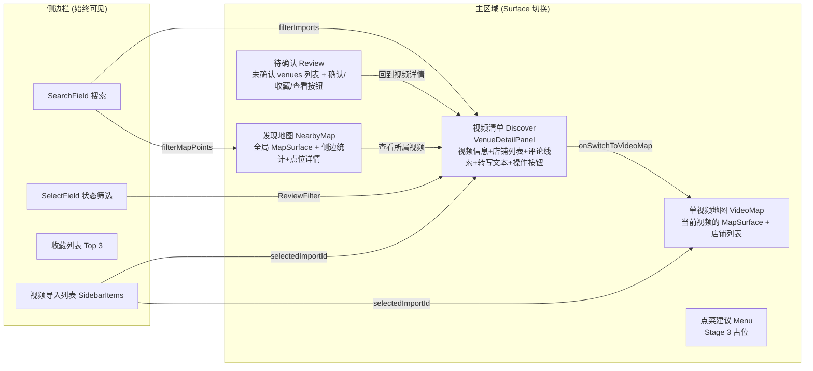

# Video Food Map — Audit & Workflow Diagrams

> Generated 2026-04-04 | Based on current codebase + spec review

---

## 1. Architecture Overview

```
┌─────────────────────────────────────────────────────────────────┐
│                     Renderer (React + Vite)                     │
│  App.tsx → SurfaceSwitcher → 5 Surfaces                        │
│  ┌──────────┐ ┌──────────┐ ┌──────────┐ ┌───────┐ ┌─────────┐ │
│  │ Discover │ │NearbyMap │ │VideoMap  │ │Review │ │  Menu   │ │
│  │ (detail) │ │ (global) │ │(per-vid) │ │ Queue │ │(stage3) │ │
│  └──────────┘ └──────────┘ └──────────┘ └───────┘ └─────────┘ │
│        │                                     │                  │
│   ┌─────────────────────────────────────────────┐               │
│   │  bridge/invoke.ts → @tauri-apps/api/core    │               │
│   └──────────────────────┬──────────────────────┘               │
└──────────────────────────┼──────────────────────────────────────┘
                           │ Tauri IPC
┌──────────────────────────┼──────────────────────────────────────┐
│                    Tauri Backend (Rust)                          │
│  main.rs → 7 Tauri Commands                                    │
│  ┌────────────┐ ┌──────────────┐ ┌────────────┐ ┌────────────┐ │
│  │ db.rs      │ │ db_queries.rs│ │ probe.rs   │ │settings.rs │ │
│  │ (SQLite)   │ │ (write logic)│ │ (geocode)  │ │ (JSON file)│ │
│  └────────────┘ └──────────────┘ └────────────┘ └────────────┘ │
│  ┌────────────────────┐  ┌───────────────┐  ┌────────────────┐  │
│  │ runtime_daemon.rs  │  │script_runner.rs│  │desktop_paths.rs│  │
│  │ (auto-start nimi)  │  │ (find tsx bin) │  │ (data dir)     │  │
│  └────────────────────┘  └───────────────┘  └────────────────┘  │
└──────────────────────────┬──────────────────────────────────────┘
                           │ spawns tsx subprocess
┌──────────────────────────┼──────────────────────────────────────┐
│                    Probe Scripts (TypeScript)                    │
│  run-bilibili-food-video-probe.mts                              │
│  ┌──────────────────────┐  ┌──────────────────────────────────┐ │
│  │ bilibili-food-video- │  │ bilibili-food-video-extraction   │ │
│  │ probe.mts (orchestr) │  │ .mts (prompt, coverage, STT)     │ │
│  └──────────────────────┘  └──────────────────────────────────┘ │
│  ┌──────────────────────┐  ┌──────────────────────────────────┐ │
│  │ bilibili-food-video- │  │ bilibili-food-video-probe-audio  │ │
│  │ comment.mts (screen) │  │ .mts (WAV split for long audio)  │ │
│  └──────────────────────┘  └──────────────────────────────────┘ │
└──────────────────────────┬──────────────────────────────────────┘
                           │ gRPC
┌──────────────────────────┼──────────────────────────────────────┐
│               nimi-runtime (Go gRPC daemon)                     │
│  STT (audio.transcribe)  |  Text (text.generate)               │
│  local whisper / cloud   |  local LLM / cloud LLM              │
└─────────────────────────────────────────────────────────────────┘
```

---

## 2. Main Workflow: Video Import (End-to-End)

```mermaid
flowchart TD
    A[用户粘贴 Bilibili 链接] --> B[点击 '导入并解析']
    B --> C{importMutation.mutate}
    C --> D[Tauri IPC: video_food_map_import_video]
    D --> E[extract_bvid_hint 提取 BV 号]
    E --> F[db::queue_import]
    F --> F1{BVID 已存在?}
    F1 -->|是| F2[复用已有 import row, 标记 running]
    F1 -->|否| F3[INSERT 新 import row]
    F2 --> G[返回 queued ImportRecord 给前端]
    F3 --> G
    G --> H[前端收到 record, 开始 1.5s 轮询 snapshot]
    G --> I[后台 thread::spawn 开始异步处理]

    I --> J[set_import_stage → resolving]
    J --> K[probe::run_probe]

    subgraph probe["Probe Script 执行流"]
        K --> K1[extractBvid 解析 BV 号]
        K1 --> K2[resolveVideoMetadata<br/>调用 Bilibili View API + Tag API]
        K2 --> K3[fetchPlayUrl<br/>调用 Bilibili playurl API]
        K3 --> K4[chooseBestAudioUrl<br/>优选标准 CDN, 避开 MCDN]

        K4 --> K5{fetchSubtitleTranscript<br/>调用 Player V2 API}
        K5 -->|有平台字幕| K6[直接使用平台字幕<br/>selectedSttModel = platform/bilibili-subtitle]
        K5 -->|无平台字幕| K7[走 Runtime STT]

        K7 --> K7a{音频 URL 直传成功?}
        K7a -->|是| K7b[全量转写<br/>coverage = full]
        K7a -->|否| K7c[下载音频 → FFmpeg 切分<br/>按段转写, coverage 可能 leading_segments_only]

        K6 --> K8[fetchPublicComments<br/>调用 Reply API, 最多 20 条]
        K7b --> K8
        K7c --> K8

        K8 --> K9[filterCommentCluesForExtraction<br/>初筛评论]
        K9 --> K10[runtime.ai.text.generate<br/>构建 extraction prompt, 连同评论线索一起送]
        K10 --> K11[extractJsonObject 从 LLM 输出提取 JSON]
        K11 --> K12[normalizeExtractionJsonToSimplified<br/>繁体 → 简体]
        K12 --> K13[mergeCommentCluesIntoExtraction<br/>评论线索合并进结构化结果]
        K13 --> K14[saveProbeArtifacts<br/>写本地 .tmp 文件]
    end

    K14 --> L[set_import_stage → geocoding]
    L --> M[db::complete_import_by_id]

    subgraph geocode_flow["Geocoding 与 Venue 写入"]
        M --> M1[parse_venue_inputs<br/>从 extraction_json.venues 解析]
        M1 --> M2[infer_import_city_hint<br/>从标题/描述/标签/评论/地址推断城市]
        M2 --> M3[load_existing_venue_user_state<br/>保留已有确认/收藏状态]
        M3 --> M4[DELETE 旧 venues → 逐条重建]

        M4 --> M5{对每个 venue}
        M5 --> M6[build_geocode_query]
        M6 --> M7{地址够具体 或 店名+城市可查?}
        M7 -->|否| M8[geocode = skipped]
        M7 -->|是| M9[geocode_address<br/>高德地理编码 API]
        M9 --> M9a{地理编码成功?}
        M9a -->|否| M9b[高德 POI 文字搜索 fallback]
        M9a -->|是| M10[resolved + 坐标]
        M9b --> M9c{POI 搜索成功?}
        M9c -->|是| M10
        M9c -->|否| M11[geocode = failed]

        M10 --> M12[resolve_review_state]
        M11 --> M12
        M8 --> M12

        M12 --> M13{判定 review_state}
        M13 -->|geocode resolved + confidence != low + 有店名| M14[map_ready]
        M13 -->|needs_review 或 无店名| M15[review]
        M13 -->|无地址 或 geocode failed| M16[search_only 或 review]

        M14 --> M17[INSERT venue row<br/>带 user_confirmed / is_favorite 继承]
        M15 --> M17
        M16 --> M17
    end

    M17 --> N[UPDATE imports SET status = succeeded]
    N --> O[前端 snapshot 轮询拿到最新数据]

    I -->|probe 失败| P[explain_import_error 友好化]
    P --> Q[mark_import_failed_by_id]
    Q --> O
```



---

## 3. Map Promotion 逻辑 (VFM-DISC-001 / VFM-DISC-007)



---

## 4. Review State 判定逻辑 (resolve_review_state)



---

## 5. STT 模型选择工作流 (VFM-PIPE-002 / VFM-PIPE-009)



---

## 6. 用户 Curation 工作流 (VFM-DISC-008)



---

## 7. Duplicate Intake 防重逻辑 (VFM-PIPE-007)



---

## 8. 评论线索补充工作流 (VFM-DISC-005)



---

## 9. Runtime Route Settings 工作流 (VFM-SHELL-009)



---

## 10. 前端 Surface 切换与数据流



---

## 11. Spec 合规审计摘要

| Spec Rule | 状态 | 实现位置 | 备注 |
|-----------|------|----------|------|
| **VFM-SHELL-001** Standalone App | **OK** | `apps/video-food-map/` | 独立 Tauri app |
| **VFM-SHELL-002** Core Surfaces | **OK** | App.tsx SurfaceSwitcher | 5 个 surface 全部注册 |
| **VFM-SHELL-003** Runtime + SDK | **OK** | probe 通过 SDK Runtime gRPC | 不直接调 provider |
| **VFM-SHELL-005** Kit-First | **OK** | 全部使用 nimi-kit/ui 组件 | Button, Surface, SearchField, etc. |
| **VFM-SHELL-009** Route Settings | **OK** | settings.rs + App.tsx 设置面板 | STT + Text 两路, 来自 runtime |
| **VFM-PIPE-001** Canonical Unit | **OK** | 1 video = 1 import record | bvid 唯一索引 |
| **VFM-PIPE-002** Extraction Order | **OK** | subtitle-first → STT fallback → extraction → comments | 严格按序 |
| **VFM-PIPE-003** Coverage Disclosure | **OK** | extractionCoverage 字段 | state + segments + duration |
| **VFM-PIPE-004** Structured Minimum | **OK** | VenueRecord 含全部必要字段 | creator_mid 作为 primary key |
| **VFM-PIPE-005** Fail-Close Store | **OK** | resolve_review_state | 无坐标不上图 |
| **VFM-PIPE-006** Multi-Venue Sep | **OK** | extraction_json.venues → 多条 venue rows | 一视频多店分离 |
| **VFM-PIPE-007** Duplicate Intake | **OK** | ensure_import_row by bvid | 复用 + 保留 user state |
| **VFM-PIPE-010** Cookieless | **OK** | 全部用 Bilibili public API | playurl + player v2 + reply |
| **VFM-PIPE-012** FFmpeg | **OK** | probe-audio.mts | 跨平台 WAV 切分 |
| **VFM-DISC-001** Map Promotion | **OK** | should_show_on_map | (map_ready OR confirmed) AND 有坐标 |
| **VFM-DISC-002** Search Dimensions | **OK** | filter.ts matchesSearch | creator/area/venue/dish/cuisine/flavor/reviewState |
| **VFM-DISC-004** Confirmation Order | **OK** | subtitle → transcript → extraction → comment | 按 PIPE-002 |
| **VFM-DISC-005** Comment Completion | **OK** | comment screening + merge | 矛盾不静默覆盖 |
| **VFM-DISC-006** Review Queue | **OK** | review surface | 未确认记录不丢弃 |
| **VFM-DISC-007** Geocoding Gate | **OK** | geocode_address + should_show_on_map | 文字线索不直接上图 |
| **VFM-DISC-008** User Curation | **OK** | confirm + favorite mutations | favorite 不改 review state |
| **VFM-MENU-001** Stage-3 | **OK** | Menu surface 为占位 | 不阻塞 stage-1 |

### 潜在改进点 (非 spec 违规)

1. **address_is_specific 判定**: 当前使用关键词匹配 (号/路/街 等), 对非标准地址格式可能误判
2. **geocode 两步 fallback**: 先地理编码 → 再 POI 搜索, 但没有 retry 机制; 高德 API 短暂不可用会直接 failed
3. **Review Queue 缺 reject 操作**: spec execution-plan Phase 2 已提到, 当前只有 confirm/favorite
4. **评论数固定 20 条**: Reply API `ps=20`, 高评论视频可能遗漏有价值线索
5. **city hint 推断**: infer_import_city_hint 用正则频次统计, 跨城市视频可能推断错误城市
