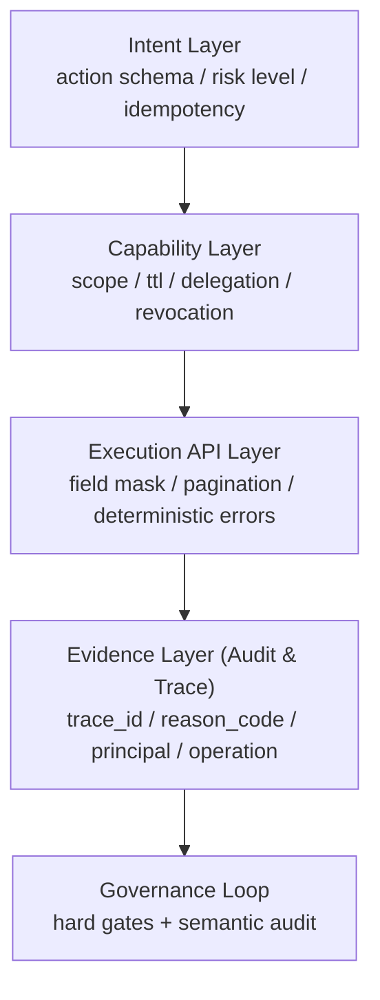

# AI Agent Security Interface Whitepaper (Nimi Approach)

> Version: 2026-03-03  
> Audience: architects, security reviewers, platform engineering teams, and agent developers  
> Objective: explain why AI agents should move from "human-like operation" to "AI-native interface calling", and how Nimi turns that into enforceable contracts

Spec rule mapping: [`spec/platform/ai-agent-security-interface.md`](../../spec/platform/ai-agent-security-interface.md)

## 0. One-Page Summary

This document has three core conclusions:

1. Agents should not rely on "human-like operation" as their primary execution path. They should call explicit machine-facing interfaces.
2. A secure agent foundation must include all of the following at once: sandboxed execution, scoped authorization, end-to-end auditability, and traceable error semantics.
3. Nimi has already encoded these capabilities as cross-layer contracts (Platform + Runtime + Desktop), with direct Rule ID traceability.

If you only need a quick feasibility review, read:

1. Sections 3, 4, 5, and 6 in this document (model, mechanisms, comparison).
2. Mapping document: [`spec/platform/ai-agent-security-interface.md`](../../spec/platform/ai-agent-security-interface.md).
3. Related kernel families: `P-ALMI-*`, `K-AUTHSVC-*`, `K-GRANT-*`, `K-AUDIT-*`, `D-SEC-*`.

## 1. Problem Definition and Threat Reality

### 1.1 Why "human-like operation" becomes a systemic risk in the agent era

Treating agents as "users that click and type" may look fast in PoCs, but introduces four structural risks:

1. Weak boundary between instruction and data: external pages, docs, and conversations can be mixed into executable intent, widening prompt injection surface.
2. Unbounded privilege: GUI automation often inherits broad account privileges instead of per-action least privilege.
3. Unverifiable execution semantics: click paths, DOM shifts, and visual detections are not stable contracts and are hard to replay.
4. Broken audit chain: it is hard to prove who triggered which high-risk write under which context.

This is not an implementation detail. It is an interface model problem.  
In LLM/agent systems, inputs are attackable, capabilities are composable, and execution is amplifiable. The interface must be constrained first.

### 1.2 Externally verifiable risk references

- OWASP GenAI/LLM Top 10 identifies Prompt Injection, Excessive Agency, and Insecure Plugin Design as high-priority risks, directly relevant to tool-using agents.  
  Source: [OWASP Top 10 for LLM Applications](https://owasp.org/www-project-top-10-for-large-language-model-applications/)
- Anthropic documentation treats jailbreak/prompt injection as ongoing defense requirements, emphasizing layered controls and monitoring.  
  Source: [Mitigate jailbreaks and prompt injections](https://docs.anthropic.com/en/docs/test-and-evaluate/strengthen-guardrails/mitigate-jailbreaks)
- MCP authorization spec requires OAuth-based authorization, token validation, and scope boundaries, showing that tool protocols require strict trust boundaries too.  
  Source: [MCP Authorization Spec (2025-11-25)](https://modelcontextprotocol.io/specification/2025-11-25/basic/authorization)
- NIST AI RMF 1.0 frames AI risk management as a system lifecycle capability, not an add-on.  
  Source: [NIST AI RMF 1.0](https://www.nist.gov/publications/artificial-intelligence-risk-management-framework-ai-rmf-10)

## 2. Design Principles (Nimi Stance)

Nimi's stance on secure agent invocation is fivefold:

1. AI-native interface first: agents call structured APIs, not pseudo-human UI behaviors.
2. Least privilege by default: capabilities are explicit; grants are constrained, revocable, and expiring.
3. Control/data plane separation: policy, authorization, audit, and execution are separated by contract.
4. Fail-close for high-risk writes: reject when authorization or execution certainty is insufficient.
5. Audit as a product capability: trace/reason/principal are protocol-level fields, not optional logs.

Related existing rule anchors:

- Platform: `P-ALMI-002/010/011/020/030`, `P-ARCH-011/030`, `P-PROTO-020/030/035/040`
- Runtime: `K-AUTHSVC-*`, `K-GRANT-*`, `K-CONN-013~015`, `K-AUDIT-*`, `K-ERR-*`, `K-PAGE-*`
- Desktop: `D-SEC-005/007/009`, `D-HOOK-007~010`, `D-MOD-005/008`

## 3. Nimi's Four-Layer Security Invocation Model

Nimi decomposes the invocation chain into four layers, each with explicit contract and failure semantics.

### 3.1 Intent Layer

The intent layer ensures actions are declarative, verifiable, and replayable:

- Action structure includes `actionId + inputSchema + outputSchema + riskLevel + compensation` (`P-ALMI-010`).
- Standard protocol is fixed: `discover -> dry-run -> verify -> commit -> audit` (`P-ALMI-011`).
- Write operations must carry `idempotencyKey` (`P-ALMI-011`, `P-PROTO-010`).

### 3.2 Capability Layer

The capability layer constrains "what can be done" to minimal required scope:

- Desktop mod capabilities are controlled by capability keys and source-type gates (`D-HOOK-006~010`, `D-SEC-005`).
- Session and principal registration are handled by `RuntimeAuthService` (`K-AUTHSVC-001~013`).
- Grant issuance, delegation, revocation, and chain visibility are handled by `RuntimeGrantService` (`K-GRANT-001~013`).
- Scope versioning and revocation semantics are explicit (`K-GRANT-008~010`, `P-PROTO-040`).

### 3.3 Execution API Layer

The execution layer requires deterministic semantics for parameters, updates, pagination, and errors:

- Patch semantics are defined by `update_mask + optional` (`K-CONN-013`).
- Owner fields are frozen; ownership is inferred from authenticated identity (`K-CONN-015`).
- List/search APIs follow unified pagination boundaries and stable ordering (`K-PAGE-001~006`, `K-LOCAL-030`).
- Error semantics use dual-layer expression: gRPC code + reason code (`K-ERR-001~010`).

### 3.4 Evidence Layer (Audit/Trace)

The evidence layer makes every execution chain attributable and inspectable:

- Minimum audit fields are fixed: `trace_id/app_id/domain/operation/reason_code/timestamp` (`K-AUDIT-001`).
- AI execution path includes extended fields such as `request_id/user_id/connector_id/provider/model/...` (`K-AUDIT-018`).
- Export, query, retention, and masking are contract-defined (`K-AUDIT-007/009/017`).
- Local audit expands core trace fields in local runtime paths (`K-LOCAL-029`).

## 4. Sandbox and Scoped Authorization

### 4.1 Sandbox is a boundary of responsibility, not a UX limitation

Nimi uses capability allowlists instead of default-open execution:

- Mod execution must pass Sandbox/Policy stage (`D-MOD-005`).
- External agent bridge commands are isolated at boundary (`D-IPC-008`, `D-SEC-007`).
- AI credential delegation has explicit contract (`D-SEC-009`) so renderer does not own raw secrets.

### 4.2 Five-dimensional authorization scoping

Authorization is scoped across five dimensions:

1. Principal: Human / NimiAgent / ExternalAgent / Device / Service (`P-ALMI-003`)
2. Time: TTL, refresh, expiry (`K-AUTHSVC-004/011`, `K-GRANT-003`)
3. Context: domain + mode/world relation pairing (`K-AUTHSVC-009/010`, `P-PROTO-060`)
4. Scope: prefix, versioning, revocation (`K-GRANT-008~010`, `P-PROTO-021/040`)
5. Delegation: subset constraints, depth limits, cascade invalidation (`K-GRANT-005/006`, `P-PROTO-035`)

### 4.3 Fail-close as an engineering rule

In Nimi, fail-close is contract-enforced:

- Authorization/token validation failures are rejected with normalized reason semantics (`K-AUTHSVC-006/013`, `K-GRANT-007`).
- Invalid field masks, invalid page tokens, and unknown update paths are rejected immediately (`K-CONN-013/014`, `K-PAGE-002`).
- Writes are blocked when execution ledger certainty cannot be guaranteed (`P-ALMI-011`).

## 5. Auditable and Traceable by Design

### 5.1 Minimum audit contract

All major execution paths must share the same audit baseline (`K-AUDIT-001`), solving two common failures:

1. cross-service security investigations cannot be stitched;
2. postmortems rely only on free-form logs.

### 5.2 Why reason codes matter

`reason_code` turns failure meaning into a stable interface:

- stable mapping for SDK/UI behavior and alerting (`K-ERR-002/006/009`);
- easy conversion of frequent failures into deterministic gates;
- regression comparability across versions for the same scenario.

### 5.3 Current boundary and future evolution

Current contracts already cover query/export/masking/attribution baseline.  
Future items (for example tamper-resistant audit chains) should be added as kernel rules, not ad-hoc domain narrative.

## 6. Comparison: Versus "Human-Like Operation Agents"

| Dimension | Human-like operation agents (GUI/RPA style) | Nimi AI-native interface approach |
|---|---|---|
| Attack surface | Mixed instruction/data, injection-prone | Constrained via structured parameters |
| Privilege control | Often broad account-level | Least privilege + scoped grants |
| Explainability | Click paths are unstable to replay | Rule and field semantics are explicit |
| Audit reproducibility | Fragmented logs, weak attribution | End-to-end trace + principal + reason |
| Compliance fit | Usually retrofitted later | Built into protocol and contracts |
| Rollback governance | App-specific patching | Contracted idempotency + compensation |

Conclusion:  
Human-like operation may appear faster in early integration, but incurs higher long-term risk and governance cost.  
Nimi's interface-first model is more sustainable for open agent ecosystems.

## 7. Adoption Guidance

### 7.1 Action modeling

Model each agent action as four explicit objects:

1. `Capability`: what the action may do;
2. `Execution API`: how it does it (explicit fields);
3. `Policy`: when it is allowed (conditions/quota/principal);
4. `Audit`: what evidence is emitted.

### 7.2 Authorization baseline

Recommended baseline:

- short TTL tokens by default;
- no delegation by default;
- high-risk operations require `verify -> commit`;
- all write operations require `idempotencyKey`.

### 7.3 Move semantic risks into deterministic gates

Prioritize hard checks for deterministic constraints:

- key behavioral changes without rule anchors should be blocked;
- high-risk write RPC without required audit fields should be blocked;
- pagination RPC without request/response pair fields should be blocked;
- new failure paths without reason code mapping should be blocked.

## 8. FAQ

### Q1: Does this reduce developer velocity?

It adds upfront modeling work, but reduces long-term debugging, compliance, and incident response costs, especially in multi-agent/multi-team systems.

### Q2: Does this over-constrain agent capabilities?

No. It constrains execution boundaries and evidence quality, not capability ceiling.  
Capabilities can still expand via versioned catalogs and policy updates.

### Q3: Is this compatible with open ecosystem/plugins?

Yes. Nimi supports open extensions through Hook/Mod capability contracts while keeping execution risk bounded (`D-HOOK-*`, `D-MOD-*`, `D-SEC-*`).

### Q4: Why not just teach agents to operate UI like humans?

Because UI is a human interaction surface, not a machine contract surface.  
Security, audit, and compliance require structured and verifiable interfaces.

## 9. Integration and Review Checklist

### 9.1 Minimum integration checklist

1. Every action has a unique `actionId` and declares `inputSchema/outputSchema/riskLevel`.
2. All write actions require `idempotencyKey` and define compensation/rollback semantics.
3. Authorization defaults to short TTL and non-delegable grants.
4. Critical APIs use explicit patch semantics (for example `update_mask`) and reject unknown paths.
5. All List/Search APIs follow stable sort + paired pagination fields.
6. Critical audit paths include `trace_id/app_id/domain/operation/reason_code/timestamp`.

### 9.2 Minimum security review checklist

1. Any privileged path still bypassing capability gates through GUI automation.
2. Any path where authorization passes but audit attribution is missing.
3. Any failure path that lacks reason code and relies on free-form text only.
4. Any deterministic constraints (mask/page token/scope prefix) not covered by hard gates.
5. Ability to trace a single request end-to-end: intent -> authorization -> execution -> outcome.

## References (official/standards/papers, verifiable)

1. OWASP GenAI Security Project, Top 10 for LLM Applications:  
   [https://owasp.org/www-project-top-10-for-large-language-model-applications/](https://owasp.org/www-project-top-10-for-large-language-model-applications/)
2. Anthropic Docs, Mitigate jailbreaks and prompt injections:  
   [https://docs.anthropic.com/en/docs/test-and-evaluate/strengthen-guardrails/mitigate-jailbreaks](https://docs.anthropic.com/en/docs/test-and-evaluate/strengthen-guardrails/mitigate-jailbreaks)
3. Model Context Protocol Specification, Authorization (2025-11-25):  
   [https://modelcontextprotocol.io/specification/2025-11-25/basic/authorization](https://modelcontextprotocol.io/specification/2025-11-25/basic/authorization)
4. Model Context Protocol Docs, Understanding Authorization in MCP:  
   [https://modelcontextprotocol.io/docs/tutorials/security/authorization](https://modelcontextprotocol.io/docs/tutorials/security/authorization)
5. NIST AI RMF 1.0 (NIST AI 100-1):  
   [https://www.nist.gov/publications/artificial-intelligence-risk-management-framework-ai-rmf-10](https://www.nist.gov/publications/artificial-intelligence-risk-management-framework-ai-rmf-10)
6. Liu et al., Prompt Injection attack against LLM-integrated Applications (arXiv:2306.05499):  
   [https://arxiv.org/abs/2306.05499](https://arxiv.org/abs/2306.05499)
7. Liu et al., Formalizing and Benchmarking Prompt Injection Attacks and Defenses (arXiv:2310.12815):  
   [https://arxiv.org/abs/2310.12815](https://arxiv.org/abs/2310.12815)
