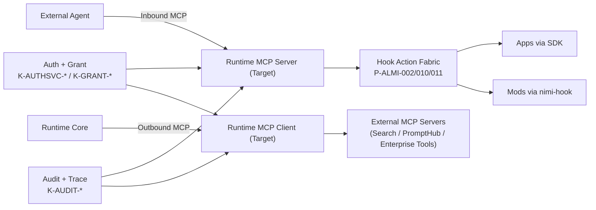
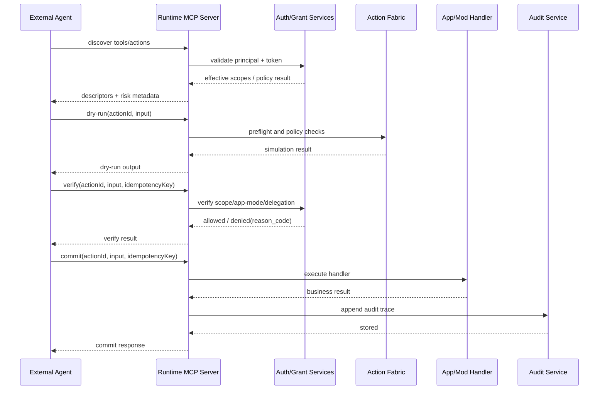
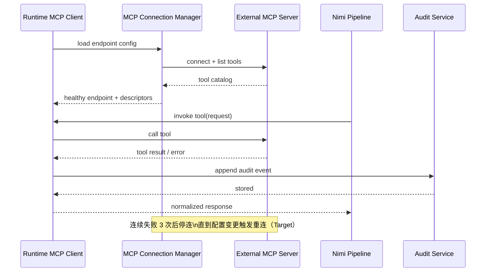

# Nimi MCP × Agent 交互架构白皮书（中文）

> 版本：2026-03-04  
> 读者：架构师、平台工程团队、安全评审、Agent/应用开发者  
> 目标：定义 Nimi 在 MCP 协议下的双向 Agent 交互模型，以及“授权 + 审计 + fail-close”平台强约束如何透明落地到 App/Mod 生态

对应 Spec 规则映射：[`spec/platform/ai-agent-security-interface.md`](../../spec/platform/ai-agent-security-interface.md)  
相关架构契约：[`spec/platform/kernel/architecture-contract.md`](../../spec/platform/kernel/architecture-contract.md)  
相关规划项：[`spec/future/kernel/tables/backlog-items.yaml`](../../spec/future/kernel/tables/backlog-items.yaml)

## 0. 一页摘要

本文核心结论：

1. MCP 在 Nimi 中定位为“互操作协议层”，用于统一 Agent 与工具/能力的连接语义。
2. Nimi 的差异化不在“再造协议”，而在“平台级治理”：授权、scope 收敛、失败语义、审计证据链都被强约束。
3. 对基于 Nimi SDK/nimi-hook 的 App/Mod 开发者，治理能力默认下沉，交互成本低、可观测性高。

如果只需快速判断可行性，建议优先阅读：

1. 第 2 章（当前状态与目标态）  
2. 第 4、5 章（入站/出站交互主链）  
3. 第 7、8、9 章（授权、审计、错误语义）  
4. 第 16 章（文档验收矩阵）

## 1. 文档定位与边界

### 1.1 文档定位

本文件是 `docs/architecture` 下的架构白皮书，用于对外解释 Nimi 的 MCP + Agent 交互模型。  
规范权威仍在 `spec/**`，本文件只做映射和工程化说明，不新增 Rule ID。

### 1.2 边界声明

1. 本文件是叙事和实施蓝图，不是规范事实源。  
2. 所有 MUST/强约束均来自既有 Rule ID。  
3. 文中“接口草案”全部标记为 `Proposed / Non-Normative`，不代表已实现。  
4. 不修改 `spec/**`、不修改 generated spec 文档。

### 1.3 关键规范锚点

1. 平台层：`P-ALMI-*`、`P-ARCH-*`、`P-PROTO-*`。  
2. Runtime 层：`K-AUTHSVC-*`、`K-GRANT-*`、`K-AUDIT-*`、`K-CONN-*`、`K-ERR-*`、`K-PAGE-*`。  
3. Desktop 层：`D-SEC-*`、`D-HOOK-*`、`D-MOD-*`、`D-IPC-*`。

## 2. 当前状态（截至 2026-03-04）与目标态

### 2.1 当前状态快照

| 维度 | 当前状态（2026-03-04） | 依据 |
|---|---|---|
| Runtime 职责定义 | 已将 `MCP Server` 写入 Runtime 职责域 | `P-ARCH-004` |
| MCP 工程条目 | `F-MCP-001` 状态为 `proposed` | `spec/future/kernel/tables/backlog-items.yaml` |
| 双向能力目标 | 明确要求 Runtime 实现 MCP server/client 双向支持 | `F-MCP-001` 架构说明 |
| 配置热重载 | 明确要求配置轮询、自动重连、单客户端连续失败 3 次后停连直到配置变更 | `F-MCP-001` 架构说明 |
| 现有 Desktop 外部 Agent 桥 | 已有 token 签发/吊销、descriptor 同步、执行完成回写、gateway 状态命令 | `D-IPC-008` / `spec/desktop/external-agent.md` |

### 2.2 目标态定义

| 维度 | 目标态 |
|---|---|
| 入站（External -> Nimi） | 外部 Agent 通过 MCP 调用 Runtime 暴露能力，执行协议固定 `discover -> dry-run -> verify -> commit -> audit` |
| 出站（Nimi -> External） | Runtime 作为 MCP Client 调用外部 MCP Server，把搜索/Prompt 源等接入 Nimi 能力图 |
| 治理 | 授权、scope、委托、审计、错误语义统一纳入 Nimi 规则体系 |
| 开发者体验 | App/Mod 只声明能力与 Action schema，安全治理默认由平台托管 |

### 2.3 Current vs Target 原则

1. Current 只描述已存在契约或代码面可见能力。  
2. Target 必须显式标注为“规划/草案”。  
3. 不把 `proposed` 条目写成“已上线”。

## 3. Nimi 中 MCP 的角色分层（双向互联全景）



### 3.1 分层解释

1. MCP 层：负责工具互联协议，不承担业务语义主权。  
2. Runtime 层：承担鉴权、执行编排、审计证据与错误统一。  
3. App/Mod 层：声明能力和处理业务逻辑，不直接实现底层授权协议。  
4. SDK/nimi-hook 层：提供统一开发入口，屏蔽治理复杂度。

### 3.2 与现有主协议面的关系

Runtime 主接入面仍是 gRPC（经 SDK）。  
MCP 是“新增互操作面”，不是替代现有协议栈。

## 4. 入站交互主链（外部 Agent 调用 Nimi）



### 4.1 协议阶段与约束

1. `discover`：返回 Action 可用性、风险等级、执行模式。  
2. `dry-run`：写操作前置模拟，降低误执行概率。  
3. `verify`：在 commit 前完成权限与策略门禁。  
4. `commit`：持久化执行结果和 ledger；不确定则 fail-close。  
5. `audit`：成功/失败均写入审计，保留追踪字段。

### 4.2 规则映射

1. 执行状态机：`P-ALMI-011`。  
2. Action schema 最小字段：`P-ALMI-010`。  
3. 外部主体接入：`P-ALMI-004` + `K-AUTHSVC-006/013`。  
4. token 授权与委托：`K-GRANT-003~013`。  
5. 审计底线：`K-AUDIT-001`。

### 4.3 fail-close 关键点

1. 授权不通过：拒绝 commit。  
2. verify 缺失：拒绝 commit。  
3. ledger 持久化不确定：拒绝提交。  
4. 高风险动作不允许 opaque 模式。

## 5. 出站交互主链（Runtime 调外部 MCP 工具）



### 5.1 连接生命周期（Target）

1. 配置加载：读取 endpoint/profile/policy。  
2. 建连探测：能力发现 + 健康检查。  
3. 正常调用：请求透传 + 响应归一化。  
4. 失败退避：指数退避重试。  
5. 熔断停连：连续失败达到阈值后暂停。  
6. 配置变更恢复：变更触发重新建连。

### 5.2 热重载要求（来自 F-MCP-001）

1. 轮询配置文件变更后自动重连。  
2. 单客户端连续失败 3 次后停止重连。  
3. 配置变化后才恢复重连循环。

### 5.3 与能力条目关系

1. `F-SEARCH-001`：可复用 MCP tool 框架。  
2. `F-PROMPTHUB-001`：优先可用 REST，长期走 MCP Client。  
3. `F-ATA-001`：A2A 能力描述依赖 MCP 基础协议。

## 6. App/Mod 透明接入模型

### 6.1 透明性的定义

“透明”不是“无治理”，而是治理下沉：

1. App/Mod 不直接处理 token 签发与链路校验。  
2. App/Mod 不直接定义审计字段格式。  
3. App/Mod 只需声明 Action schema、capabilities、handler。  
4. Runtime/SDK/nimi-hook 统一处理授权、审计、错误投影。

### 6.2 分层职责矩阵

| 层 | 主要职责 | 对开发者可见性 |
|---|---|---|
| App/Mod | 业务处理、Action 声明、能力最小化申请 | 高 |
| Hook Runtime | 能力白名单、source type 约束、Action 执行门禁 | 中 |
| Runtime Auth/Grant | 会话、token、scope、delegation、AppMode gate | 低 |
| Runtime Audit | trace/reason_code/operation 统一留痕 | 低 |
| SDK | 类型投影、错误归一、调用封装 | 高 |

### 6.3 透明接入的前提

1. Action 描述必须完整（`P-ALMI-010`）。  
2. 高风险写操作必须可验证可审计（`P-ALMI-011`）。  
3. Mod 必须在能力沙箱内执行（`D-SEC-005`, `D-HOOK-007~010`, `D-MOD-005`）。

## 7. 授权模型（平台级强约束）

### 7.1 Principal 与会话

执行主体统一模型：Human / NimiAgent / ExternalAgent / Device / Service（`P-ALMI-003`）。  
ExternalAgent 必须使用显式签发、有限期凭证（`P-ALMI-004`）。

### 7.2 Session/TTL 基线

1. `OpenSession/RefreshSession` TTL 受服务端上下限约束（`K-AUTHSVC-004/011`）。  
2. 重启后内存 session 失效，消费方需重建会话（`K-AUTHSVC-012`）。  
3. ExternalPrincipal proof 校验失败统一拒绝（`K-AUTHSVC-006/013`）。

### 7.3 Scope 与委托

1. scope 前缀必须合法（`K-GRANT-009`）。  
2. 委托必须是父 token 子集，且有深度上限（`K-GRANT-005`）。  
3. 撤销可级联并可观测（`K-GRANT-006`, `P-PROTO-035`）。

### 7.4 AppMode gate 顺序

`AppMode` 域门禁优先于 scope 门禁（`K-AUTHSVC-009`）。  
模式不合法或组合错误必须拒绝（`K-AUTHSVC-010`）。

### 7.5 授权预设使用矩阵

| preset | 能力范围 | 委托能力 | 典型用途 |
|---|---|---|---|
| `readOnly` | 只读 | 否 | 外部 Agent 查询、审计检索 |
| `full` | 读写 | 否 | 受信自动化执行 |
| `delegate` | 读写 | 是（默认单跳） | 受控代理链路 |

## 8. 审计与证据链模型

### 8.1 最小审计字段（全路径）

所有审计路径必须至少包含：

1. `trace_id`  
2. `app_id`  
3. `domain`  
4. `operation`  
5. `reason_code`  
6. `timestamp`

来源：`K-AUDIT-001`。

### 8.2 AI 执行扩展字段

AI 执行路径在底线字段上扩展：

1. `request_id`  
2. `user_id`  
3. `client_id`（可选）  
4. `connector_id`（若适用）  
5. `provider`  
6. `model`  
7. `request_source`  
8. `usage`  
9. `grpc_code`（失败时）

来源：`K-AUDIT-018`。

### 8.3 授权链审计字段

auth/grant 场景可记录：

1. `principal_id` / `principal_type`  
2. `token_id` / `parent_token_id`  
3. `consent_id` / `consent_version`  
4. `policy_version` / `scope_catalog_version`

来源：`K-AUDIT-006`。

### 8.4 脱敏规则

对 `*api_key*`、`*secret*`、`*token*`（结构标识例外）等字段执行统一脱敏。  
脱敏在审计写入层实施，不依赖上游调用方。来源：`K-AUDIT-017`。

### 8.5 查询与导出

1. `ListAuditEvents`：分页+过滤。  
2. `ExportAuditEvents`：server-stream 导出。  
3. 容量默认环形缓冲，超限 FIFO 淘汰。

来源：`K-AUDIT-007/009/013`。

## 9. 错误语义与 fail-close

### 9.1 错误表达模型

Nimi 错误语义采用双层表达：

1. 传输层：gRPC code。  
2. 业务层：`reason_code`（必须可解析）。

目标是让 SDK/UI/告警系统对失败语义有稳定映射。

### 9.2 典型拒绝路径

| 场景 | 预期结果 | 规则锚点 |
|---|---|---|
| External proof 无效 | `UNAUTHENTICATED + AUTH_TOKEN_INVALID` | `K-AUTHSVC-006` |
| External token 过期 | `UNAUTHENTICATED + AUTH_TOKEN_EXPIRED` | `K-AUTHSVC-013` |
| proof_type 不支持 | `INVALID_ARGUMENT + AUTH_UNSUPPORTED_PROOF_TYPE` | `K-AUTHSVC-013` |
| AppMode 域违规 | `APP_MODE_DOMAIN_FORBIDDEN` | `K-AUTHSVC-009` |
| AppMode scope 违规 | `APP_MODE_SCOPE_FORBIDDEN` | `K-AUTHSVC-009` |
| manifest 组合非法 | `APP_MODE_MANIFEST_INVALID` | `K-AUTHSVC-010` |
| scope 前缀非法 | `APP_SCOPE_FORBIDDEN` | `K-GRANT-009` |
| 命中撤销 scope | `APP_SCOPE_REVOKED` | `K-GRANT-010`, `P-PROTO-040` |
| token 链根缺失 | `NOT_FOUND + GRANT_TOKEN_CHAIN_ROOT_NOT_FOUND` | `K-GRANT-013` |
| token 链根为空 | `INVALID_ARGUMENT + GRANT_TOKEN_CHAIN_ROOT_REQUIRED` | `K-GRANT-013` |
| 字段掩码/分页参数非法 | 拒绝并返回可解析 `reason_code` | `K-CONN-013/014`, `K-PAGE-002` |

### 9.3 fail-close 规则

1. 高风险写操作在授权不充分或证据不完整时必须拒绝。  
2. verify 阶段未通过，commit 不得执行。  
3. 执行持久化不确定时终止写路径。

## 10. MCP 能力目录与 Nimi 能力映射

### 10.1 四类能力域

| 能力域 | Nimi 能力对象 | 典型调用约束 |
|---|---|---|
| 模型推理 | Runtime AI 生成/流式生成/多模态推理 | provider/model/route 必须可审计 |
| 知识库 | 文档检索、上下文拼装、RAG 管道 | read scope 默认优先，写操作需 verify |
| Workflow | DAG 编排、任务触发、补偿执行 | 幂等键 + 补偿策略必需 |
| App/Mod Action | Hook Action Fabric 暴露的业务动作 | 必须声明 riskLevel、supportsDryRun、auditEventMap |

### 10.2 调用边界

1. MCP 只负责互操作协议，不绕过 Nimi 主体授权。  
2. 所有外部调用必须落在 Runtime 的 auth/grant/audit 边界内。  
3. Mod 不得绕过 nimi-hook 直接绕行到未授权面。

### 10.3 与 OpenAI-compatible 的关系

1. MCP：面向 Agent 工具互联。  
2. OpenAI-compatible：面向推理 API 兼容。  
3. 二者互补，不冲突（见 `F-OAICOMPAT-001` 与 `F-MCP-001` 说明）。

## 11. 运维与可用性

### 11.1 连接与恢复策略（Target）

1. 配置轮询检测变更。  
2. 失败重试采用退避策略。  
3. 连续失败达到阈值后熔断停连。  
4. 配置变更触发恢复建连。

### 11.2 健康观测

1. 运行时健康：`GetRuntimeHealth` / `SubscribeRuntimeHealthEvents`。  
2. Provider 健康：`ListAIProviderHealth` / `SubscribeAIProviderHealthEvents`。  
3. MCP 连接健康（Target）：按 endpoint/tool 粒度输出状态。

### 11.3 容量与保留

1. 全局审计容量默认 20,000（可配置）。  
2. 使用量样本默认 50,000（可配置）。  
3. local 审计与 global 审计独立存储，不自动汇流。

### 11.4 安全配置分层

1. Desktop 端点前置防线：loopback 限制、IPC 入口约束。  
2. Runtime 端点权威防线：协议、地址、DNS/TOCTOU 校验。  
3. 审计写入层统一脱敏。

## 12. 典型场景

### 场景 A：只读查询（readOnly）

1. External Agent 通过 MCP discover 可读动作。  
2. 触发 dry-run/verify。  
3. 读操作直接返回。  
4. 若尝试 commit 写动作，按策略拒绝并记录审计。

### 场景 B：高风险写操作双阶段提交

1. `discover` 获取风险标签 `high`。  
2. `dry-run` 返回影响预览。  
3. `verify` 检查 scope、AppMode、委托深度。  
4. `commit` 执行并写 execution ledger。  
5. 失败时返回结构化错误并审计归档。

### 场景 C：跨 App/Mod 组合调用

1. Action Fabric 编排多个 App/Mod 能力。  
2. 所有子动作共用 trace，分别写审计事件。  
3. 任一关键子动作失败触发补偿或中断。  
4. 输出统一 reason_code 族，便于上层处理。

### 场景 D：外部 Prompt/搜索接入

1. 初期可走 REST Mod 接入（`F-PROMPTHUB-001`）。  
2. 目标态统一经 Runtime MCP Client 接入外部 MCP Server。  
3. 输出注入到 Nimi 推理管道，并保持审计闭环。

## 13. 演进路线（与 backlog 对齐）

| 阶段 | 里程碑 | 依赖关系 | 毕业条件 |
|---|---|---|---|
| Phase 1 | `F-MCP-001` 打底：server/client 双向骨架 + Desktop 管理 UI | 核心条目 | 入站/出站都可走统一鉴权与审计 |
| Phase 2 | `F-SEARCH-001` 搜索工具接入 | 依赖 `F-MCP-001` | 搜索能力可作为标准 tool 调用 |
| Phase 3 | `F-PROMPTHUB-001` 外部 Prompt 源 MCP 化 | 依赖 `F-MCP-001` | Prompt 源接入与执行链路打通 |
| Phase 4 | `F-ATA-001` A2A 跨实例能力描述 | 依赖 `F-MCP-001` | AgentCard 与任务委派可跨实例运行 |

### 13.1 毕业判定建议

1. 协议面：discover/dry-run/verify/commit/audit 全链路可运行。  
2. 治理面：授权、委托、撤销、审计、错误语义全部可验证。  
3. 运营面：连接恢复、熔断、监控、导出能力达标。  
4. 生态面：App/Mod 无需重复实现底层安全协议。

## 14. FAQ

### Q1：这是不是“在 MCP 外面包一层网关”？

不是。  
Nimi 的关键点是把授权、策略、审计、失败语义做成平台级强约束，并对 App/Mod 默认生效，不依赖业务方各自补齐。

### Q2：为什么说这是平台创新而不是协议创新？

MCP 是通用协议层。  
创新点在于 Nimi 将 MCP 调用接入到现有 `Auth/Grant/Audit/Hook` 契约里，形成可治理、可追责、可扩展的执行底座。

### Q3：App/Mod 开发者会不会增加大量接入成本？

主要新增成本在“动作建模质量”（schema、风险分级、补偿语义）。  
授权和审计链路由平台托管，整体接入复杂度可控。

### Q4：是否会牺牲灵活性？

不会。  
Nimi 约束的是执行边界与证据质量，不是能力上限。能力扩展仍可通过版本化 catalog 与 policy 演进。

## 15. 接口草案（Proposed / Non-Normative）

> 状态标签：**Proposed / Non-Normative**  
> 说明：本章只用于设计沟通，不构成当前实现承诺或规范事实源。

### 15.1 Runtime MCP 接口族（草案）

```ts
interface RuntimeMcpService {
  ListEndpoints(req: ListEndpointsRequest): ListEndpointsResponse;
  UpsertEndpoint(req: UpsertEndpointRequest): UpsertEndpointResponse;
  ListTools(req: ListToolsRequest): ListToolsResponse;
  InvokeTool(req: InvokeToolRequest): InvokeToolResponse;
  GetEndpointHealth(req: GetEndpointHealthRequest): GetEndpointHealthResponse;
  SubscribeEndpointEvents(req: SubscribeEndpointEventsRequest): AsyncIterable<EndpointEvent>;
}
```

### 15.2 SDK MCP 门面类型（草案）

```ts
type McpEndpointProfile = {
  endpointId: string;
  transport: 'stdio' | 'http' | 'ws';
  authMode: 'none' | 'bearer' | 'oauth2';
  enabled: boolean;
};

type McpToolDescriptor = {
  toolId: string;
  title: string;
  inputSchema: Record<string, unknown>;
  outputSchema: Record<string, unknown>;
  riskLevel: 'low' | 'medium' | 'high';
};

type McpToolInvokeRequest = {
  endpointId: string;
  toolId: string;
  input: Record<string, unknown>;
  dryRun?: boolean;
  verifyToken?: string;
  idempotencyKey?: string;
};

type McpToolInvokeResult = {
  ok: boolean;
  data?: Record<string, unknown>;
  reasonCode?: string;
  traceId: string;
};

type McpAuditContext = {
  appId: string;
  principalId: string;
  operation: string;
  traceId: string;
};
```

### 15.3 Desktop 管理面模型（草案）

```ts
type McpServerConfig = {
  endpointId: string;
  displayName: string;
  connectionUri: string;
  retryPolicy: 'exponential_backoff';
  maxConsecutiveFailures: number;
};

type McpConnectionState = 'configured' | 'connecting' | 'healthy' | 'degraded' | 'fused';

type McpAuthBinding = {
  endpointId: string;
  authMode: 'none' | 'bearer' | 'oauth2';
  scopePreset: 'readOnly' | 'full' | 'delegate';
};

type McpPolicyPreset = 'readOnly' | 'full' | 'delegate';
```

### 15.4 App/Mod 受控 Action 映射（草案）

```ts
type NimiActionDescriptor = {
  actionId: string;
  inputSchema: Record<string, unknown>;
  outputSchema: Record<string, unknown>;
  riskLevel: 'low' | 'medium' | 'high';
  executionMode: 'full' | 'guarded' | 'opaque';
  supportsDryRun: boolean;
  idempotent: boolean;
  auditEventMap: Record<string, string>;
  compensation?: { strategy: 'none' | 'saga'; actionId?: string };
};
```

对齐来源：`P-ALMI-010`。

## 16. 文档验收矩阵（测试用例与场景）

| # | 测试场景 | 预期结果 |
|---|---|---|
| 1 | readOnly preset 下 discover/dry-run | 成功返回 |
| 2 | readOnly preset 下 commit 写操作 | 被拒绝并审计 |
| 3 | 缺 verify 直接 commit | 被拒绝并返回可解析 reason_code |
| 4 | scope 越权 | 拒绝，reason_code 非空 |
| 5 | token 过期 | 认证失败，可触发会话重建 |
| 6 | delegation 深度超限 | 拒绝且链路可审计 |
| 7 | AppMode 不匹配 | 域门禁先触发 |
| 8 | 审计字段检查 | 最小 6 字段完整，敏感字段脱敏 |
| 9 | 出站 MCP 客户端连续失败 | 3 次后停连，配置变更后恢复 |
| 10 | Mod 能力越界调用 | 被能力沙箱拒绝并可追踪 |

## 附录 A：Rule ID 映射矩阵

| 白皮书主题 | 核心规则锚点 |
|---|---|
| Runtime 角色与 MCP 定位 | `P-ARCH-004`, `P-ARCH-020` |
| Action 状态机与高风险约束 | `P-ALMI-010`, `P-ALMI-011` |
| ExternalAgent 接入 | `P-ALMI-004`, `K-AUTHSVC-006`, `K-AUTHSVC-013` |
| 最小权限与主体模型 | `P-ALMI-003`, `K-GRANT-003` |
| AppMode gate | `K-AUTHSVC-009`, `K-AUTHSVC-010` |
| Scope 前缀与撤销 | `K-GRANT-009`, `K-GRANT-010`, `P-PROTO-040` |
| 委托链路 | `P-PROTO-035`, `K-GRANT-005`, `K-GRANT-006`, `K-GRANT-013` |
| 审计底线与扩展 | `K-AUDIT-001`, `K-AUDIT-006`, `K-AUDIT-018` |
| 审计导出与容量 | `K-AUDIT-007`, `K-AUDIT-009`, `K-AUDIT-013` |
| 审计脱敏 | `K-AUDIT-017` |
| 字段更新与分页确定性 | `K-CONN-013`, `K-CONN-014`, `K-PAGE-002` |
| Desktop 外部 Agent 安全面 | `D-SEC-007`, `D-IPC-008`, `D-HOOK-009` |
| Mod 能力沙箱 | `D-SEC-005`, `D-HOOK-007~010`, `D-MOD-005` |

## 附录 B：术语表

| 术语 | 定义 |
|---|---|
| MCP | Model Context Protocol，Agent/工具互联协议层 |
| Principal | 执行主体（Human/NimiAgent/ExternalAgent/Device/Service） |
| Grant | 由 RuntimeGrantService 管理的授权令牌及策略结果 |
| Scope | 可执行能力边界的字符串表达与版本化集合 |
| Delegation | 父 token 向子 token 下发子集权限的机制 |
| AppMode gate | 按应用模式限制域访问的前置门禁 |
| reason_code | 业务语义级错误码，用于稳定归因和治理 |
| fail-close | 条件不确定时拒绝高风险执行的默认策略 |
| Execution Ledger | commit 阶段的执行记录与持久化证据 |
| Action Fabric | 基于 Hook 能力实现的动作注册与执行治理层 |
