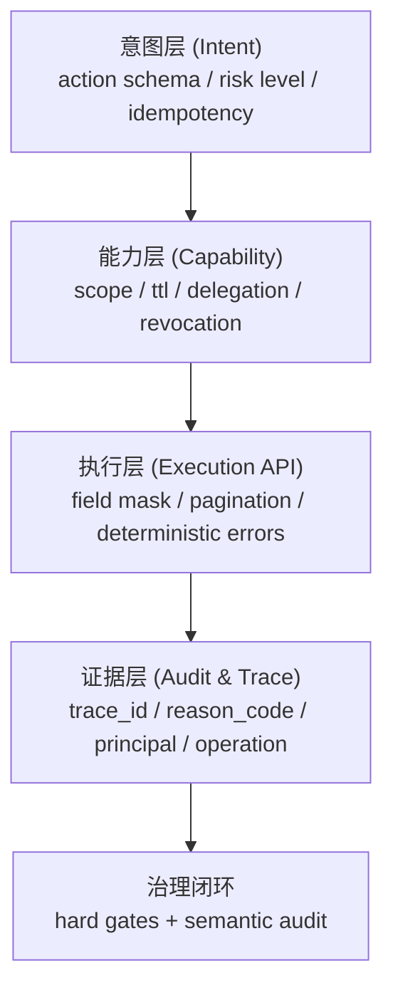

# AI Agent 安全调用接口白皮书（Nimi 方案）

> 版本：2026-03-03  
> 读者：架构师、安全评审、平台工程团队、Agent 开发者  
> 目标：解释为什么 AI Agent 必须从“模拟人类操作”转向“AI 原生接口调用”，并给出 Nimi 的可落地方案与规则锚点

对应 Spec 规则映射：[`spec/platform/ai-agent-security-interface.md`](https://github.com/nimiplatform/nimi/blob/main/spec/platform/ai-agent-security-interface.md)

## 0. 一页摘要

本文的核心结论只有三条：

1. Agent 不应依赖“模拟人类操作”作为主执行路径，必须调用面向机器的显式接口。
2. 安全底座必须同时具备：沙盒执行、局部授权、全链路审计、可追溯错误语义。
3. Nimi 已将上述能力写成跨层契约（Platform + Runtime + Desktop），可直接映射到现有 Rule ID，不是概念性口号。

如果只需要快速评估接入可行性，建议先读：

1. 本文第 3、4、5、6 章（模型、机制、对比）。
2. 映射文档：[`spec/platform/ai-agent-security-interface.md`](https://github.com/nimiplatform/nimi/blob/main/spec/platform/ai-agent-security-interface.md)。
3. 对应 kernel 合同：`P-ALMI-*`、`K-AUTHSVC-*`、`K-GRANT-*`、`K-AUDIT-*`、`D-SEC-*`。

## 1. 问题定义与威胁现实

### 1.1 为什么“模拟人类操作”在 Agent 时代会变成系统性风险

把 Agent 当“会点鼠标和敲键盘的人”看待，在 PoC 阶段看起来快，但会带来四类结构性问题：

1. 指令与数据边界不清：外部页面、文档、对话内容会混入可执行意图，形成提示词注入攻击面。
2. 权限边界不可计算：GUI 自动化常依赖账户已有全量权限，难以对单个动作最小授权。
3. 执行语义不可验证：点击路径、DOM 变化、视觉识别结果不具备稳定契约，回放和复现困难。
4. 审计链断裂：谁在什么上下文触发了什么高风险写操作，很难做到结构化留痕与归因。

这不是“实现细节”问题，而是接口模型问题。  
在 LLM/Agent 场景中，输入是可攻击的，能力是可组合的，执行是可放大的，因此必须先设计可约束的机器接口。

### 1.2 外部可核验风险依据

- OWASP GenAI/LLM Top 10 将 Prompt Injection、Excessive Agency、Insecure Plugin Design 等列为高优先风险，直接对应 Agent 工具调用场景。  
  来源：[OWASP Top 10 for LLM Applications](https://owasp.org/www-project-top-10-for-large-language-model-applications/)
- Anthropic 官方文档明确将 jailbreak/prompt injection 作为持续防护对象，并强调输入校验、分层防护、持续监控。  
  来源：[Mitigate jailbreaks and prompt injections](https://docs.anthropic.com/en/docs/test-and-evaluate/strengthen-guardrails/mitigate-jailbreaks)
- MCP 官方规范把授权建立在 OAuth 2.1，要求访问令牌验证、401/403 语义、scope 约束，说明“工具协议”本身也需要严谨授权面。  
  来源：[MCP Authorization Spec (2025-11-25)](https://modelcontextprotocol.io/specification/2025-11-25/basic/authorization)
- NIST AI RMF 1.0强调将 AI 风险管理嵌入系统生命周期，而非事后外挂。  
  来源：[NIST AI RMF 1.0](https://www.nist.gov/publications/artificial-intelligence-risk-management-framework-ai-rmf-10)

## 2. 设计原则（Nimi 立场）

Nimi 对 Agent 安全调用的立场可以归纳为五条：

1. AI 原生接口优先：Agent 调用的是结构化 API，而不是“伪装成人”操作界面。
2. 最小权限默认：能力必须显式声明，授权必须可收敛、可撤销、可过期。
3. 控制面与数据面分离：策略决策、授权、审计与业务执行分层治理。
4. 高风险写操作 fail-close：状态不确定、授权不充分、证据不完整时拒绝执行。
5. 审计是内建能力：trace/reason/principal 不是附加日志，而是协议级字段。

对应 Nimi 现有规范锚点：

- 平台层：`P-ALMI-002/010/011/020/030`、`P-ARCH-011/030`、`P-PROTO-020/030/035/040`
- Runtime 层：`K-AUTHSVC-*`、`K-GRANT-*`、`K-CONN-013~015`、`K-AUDIT-*`、`K-ERR-*`、`K-PAGE-*`
- Desktop 层：`D-SEC-005/007/009`、`D-HOOK-007~010`、`D-MOD-005/008`

## 3. Nimi 的四层安全调用模型

Nimi 将 Agent 调用链拆成四层，每层都有明确契约和失败语义。

### 3.1 意图层（Intent）

意图层要求动作可声明、可验证、可回放，避免“自然语言黑盒执行”：

- 用 `actionId + inputSchema + outputSchema + riskLevel + compensation` 描述动作（`P-ALMI-010`）。
- 执行协议固定 `discover -> dry-run -> verify -> commit -> audit`（`P-ALMI-011`）。
- 写操作必须有 `idempotencyKey`（`P-ALMI-011`, `P-PROTO-010`）。

### 3.2 能力层（Capability / Scope）

能力层负责把“能做什么”收敛到最小必要集合：

- Desktop Mod 能力由 capability key 与 source-type 网关控制（`D-HOOK-006~010`, `D-SEC-005`）。
- Runtime 会话与主体注册归 `RuntimeAuthService`（`K-AUTHSVC-001~013`）。
- 授权签发、委托、撤销、链路可见性归 `RuntimeGrantService`（`K-GRANT-001~013`）。
- 作用域版本与撤销语义显式化（`K-GRANT-008~010`, `P-PROTO-040`）。

### 3.3 执行层（Execution API）

执行层要求“参数确定、更新确定、分页确定、错误确定”：

- Patch 语义由 `update_mask + optional` 共同定义（`K-CONN-013`）。
- owner 字段冻结，归属由认证身份推导（`K-CONN-015`）。
- 列表/搜索统一分页边界、token 语义与排序稳定性（`K-PAGE-001~006`, `K-LOCAL-030`）。
- 错误模型使用 gRPC code + reason_code 双层表达（`K-ERR-001~010`）。

### 3.4 证据层（Audit / Trace）

证据层保证“谁做了什么、为何成功或失败”可以跨层追踪：

- 审计最小字段固定：`trace_id/app_id/domain/operation/reason_code/timestamp`（`K-AUDIT-001`）。
- AI 执行路径扩展字段：`request_id/user_id/connector_id/provider/model/...`（`K-AUDIT-018`）。
- 审计导出、分页查询、容量与脱敏规范固定（`K-AUDIT-007/009/017`）。
- 本地审计字段扩展到 `trace/app/domain/operation/subject_user_id`（`K-LOCAL-029`）。

## 4. 沙盒与局部授权机制

### 4.1 沙盒不是“限制体验”，而是定义责任边界

Nimi 的沙盒策略强调能力白名单，而不是“默认全开再打补丁”：

- Mod 执行必须经过 Sandbox/Policy 阶段（`D-MOD-005`）。
- 外部 Agent 与 Desktop 的桥接命令有独立边界（`D-IPC-008`, `D-SEC-007`）。
- AI 凭据委托模型单独建模（`D-SEC-009`），避免 renderer 暴露密钥。

### 4.2 局部授权的五维收敛

Nimi 授权收敛到以下维度：

1. 主体：Human / NimiAgent / ExternalAgent / Device / Service（`P-ALMI-003`）
2. 时间：TTL、会话续期、过期（`K-AUTHSVC-004/011`, `K-GRANT-003`）
3. 场景：domain 与 mode/world relation 组合（`K-AUTHSVC-009/010`, `P-PROTO-060`）
4. 范围：scope 前缀、版本、撤销（`K-GRANT-008~010`, `P-PROTO-021/040`）
5. 委托：父子 token 子集约束、深度限制、级联失效（`K-GRANT-005/006`, `P-PROTO-035`）

### 4.3 fail-close 的工程化落点

在 Nimi 中，fail-close 不是口号，而是有规则落点：

- 授权或 token 校验失败统一拒绝并归一 reason code（`K-AUTHSVC-006/013`, `K-GRANT-007`）。
- 字段掩码非法、分页 token 非法、未知路径更新等直接拒绝（`K-CONN-013/014`, `K-PAGE-002`）。
- 执行 ledger 不确定时禁止写入继续推进（`P-ALMI-011`）。

## 5. 可审计与可追溯机制

### 5.1 最小审计字段契约

Nimi 要求所有路径至少满足同一组审计底线字段（`K-AUDIT-001`），这解决了两个典型问题：

1. 安全审计无法跨服务拼接；
2. 业务复盘只能看文本日志、无法机器分析。

### 5.2 reason code 的治理价值

`reason_code` 把“失败语义”变成结构化接口，而不是文案文本：

- 便于 SDK/UI 稳定映射与分级告警（`K-ERR-002/006/009`）。
- 便于将高频失败纳入 deterministic gate（例如分页 token、mask path、scope mismatch）。
- 便于跨版本回归比较“同场景是否仍失败为同类错误”。

### 5.3 当前边界与未来增强

当前规范已覆盖“可查询、可导出、可脱敏、可归因”的审计基线。  
防篡改审计链等增强能力属于未来可演进项，应在 kernel 中规则化后落地，不应在 domain 层口头约定。

## 6. 与“模拟人类操作 Agent”方案对比（重点）

| 维度 | 模拟人类操作 Agent（GUI/RPA 风格） | Nimi AI 原生接口方案 |
|---|---|---|
| 攻击面 | 指令/数据混合，外部上下文易注入 | 接口字段与动作协议显式化 |
| 权限收敛 | 常依赖账号全量权限 | capability + scope + TTL + delegation 子集 |
| 可解释性 | 点击链难稳定复现 | action schema / update_mask / reason_code |
| 审计复现 | 日志离散，归因弱 | trace_id + principal + operation + reason_code |
| 合规适配 | 事后补日志/补审批 | 授权、审计、脱敏是协议内建 |
| 回滚治理 | 依赖业务侧自定义补丁 | 协议要求补偿与幂等键（SAGA/idempotency） |

结论：  
模拟人类操作路线在初期集成速度上可能更快，但其长期安全治理、审计成本和合规风险更高。  
Nimi 的接口化路线把安全性前移为架构属性，更适合开放 Agent 生态的长期演进。

## 7. 采用建议（给接入方）

### 7.1 动作建模建议

把每个 Agent 动作拆分为四个对象：

1. `Capability`：声明它“能做什么”；
2. `Execution API`：声明它“如何做（显式参数）”；
3. `Policy`：声明它“何时可做（条件、额度、主体）”；
4. `Audit`：声明它“做完后留下什么证据”。

### 7.2 授权基线建议

推荐默认基线：

- 默认只发短 TTL token；
- 默认不可委托，必须显式开启；
- 高风险操作必须 `verify -> commit` 两段；
- 所有写操作都要求 `idempotencyKey`。

### 7.3 把语义风险纳入 deterministic gate

优先把可确定检查项脚本化为硬门禁：

- 未锚定 Rule ID 的关键行为变更阻断；
- 新增高风险写 RPC 未定义审计字段阻断；
- 新增分页 RPC 未满足 request/response 成对字段阻断；
- 新增错误路径未映射 reason code 阻断。

## 8. FAQ

### Q1：这会不会降低开发效率？

短期会增加接口建模成本；中长期会降低排障和合规成本。  
尤其在多 Agent、多工具、多团队协作时，结构化接口比 GUI 自动化更可维护。

### Q2：会不会过度约束 Agent 能力？

不会。约束的是“执行边界和证据链”，不是“能力上限”。  
可以通过 capability 扩展和 scope catalog 版本化逐步放权，但每一步都可审计、可撤销。

### Q3：是否支持开放生态与插件？

支持。Nimi 通过 Hook/Mod 能力模型和沙盒策略支持开放扩展，同时把风险约束在可声明能力集合内（`D-HOOK-*`, `D-MOD-*`, `D-SEC-*`）。

### Q4：为什么不继续走“让 Agent 学会像人操作 UI”？

因为 UI 是人机交互层，不是机器契约层。  
在安全、审计、合规要求上，机器契约必须是结构化、可验证、可追踪的。

## 9. 接入与评审检查清单

### 9.1 接入方最小落地清单

1. 每个 Agent 动作有唯一 `actionId`，并声明 `inputSchema/outputSchema/riskLevel`。
2. 所有写动作都要求 `idempotencyKey`，并具备补偿或回滚策略。
3. 授权默认短 TTL，默认不可委托，超权限请求返回结构化错误。
4. 关键 API 使用显式 patch 语义（如 `update_mask`）并阻断未知字段路径。
5. 所有 List/Search API 满足分页成对字段与稳定排序约束。
6. 关键路径审计至少包含 `trace_id/app_id/domain/operation/reason_code/timestamp`。

### 9.2 安全评审最小验收清单

1. 是否仍存在通过 GUI 自动化绕过能力网关的高权限路径。
2. 是否存在“授权通过但无审计字段”或“有审计但无法归因主体”的调用。
3. 是否存在 reason code 缺失、错误语义仅靠文本信息表达的失败路径。
4. 是否存在分页 token、字段掩码、scope 前缀等确定性约束未被硬门禁覆盖。
5. 是否可在单条 trace 上完成“意图 -> 授权 -> 执行 -> 结果”的跨层追踪。

## 参考资料（官方/标准/论文，可核验）

1. OWASP GenAI Security Project, Top 10 for LLM Applications:  
   [https://owasp.org/www-project-top-10-for-large-language-model-applications/](https://owasp.org/www-project-top-10-for-large-language-model-applications/)
2. Anthropic Docs, Mitigate jailbreaks and prompt injections:  
   [https://docs.anthropic.com/en/docs/test-and-evaluate/strengthen-guardrails/mitigate-jailbreaks](https://docs.anthropic.com/en/docs/test-and-evaluate/strengthen-guardrails/mitigate-jailbreaks)
3. Model Context Protocol Specification, Authorization (2025-11-25):  
   [https://modelcontextprotocol.io/specification/2025-11-25/basic/authorization](https://modelcontextprotocol.io/specification/2025-11-25/basic/authorization)
4. Model Context Protocol Docs, Understanding Authorization in MCP:  
   [https://modelcontextprotocol.io/docs/tutorials/security/authorization](https://modelcontextprotocol.io/docs/tutorials/security/authorization)
5. NIST AI RMF 1.0 (NIST AI 100-1):  
   [https://www.nist.gov/publications/artificial-intelligence-risk-management-framework-ai-rmf-10](https://www.nist.gov/publications/artificial-intelligence-risk-management-framework-ai-rmf-10)
6. Liu et al., Prompt Injection attack against LLM-integrated Applications (arXiv:2306.05499):  
   [https://arxiv.org/abs/2306.05499](https://arxiv.org/abs/2306.05499)
7. Liu et al., Formalizing and Benchmarking Prompt Injection Attacks and Defenses (arXiv:2310.12815):  
   [https://arxiv.org/abs/2310.12815](https://arxiv.org/abs/2310.12815)
